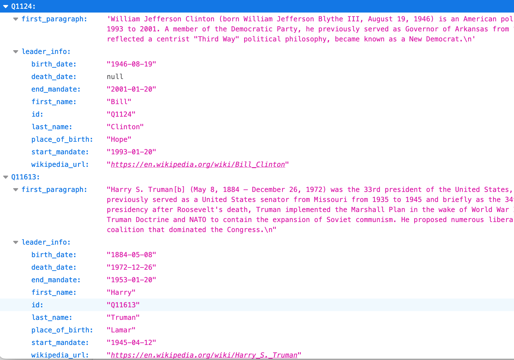

# Wikipedia Scraper

Welcome to the Wikipedia Scraper!
 <pre>
        __________      ________________ _______ ______ ________________
|\     /\__   __| \    /\__   __(  ____ (  ____ (  __  \\__   __(  ___  )
| )   ( |  ) (  |  \  / /  ) (  | (    )| (    \| (  \  )  ) (  | (   ) |
| | _ | |  | |  |  (_/ /   | |  | (____)| (__   | |   ) |  | |  | (___) |
| |( )| |  | |  |   _ (    | |  |  _____|  __)  | |   | |  | |  |  ___  |
| || || |  | |  |  ( \ \   | |  | (     | (     | |   ) |  | |  | (   ) |
| () () ___) (__|  /  \ ___) (__| )     | (____/| (__/  ___) (__| )   ( |
(_____________________ _______________ _________________________|/     \|
      (  ____ (  ____ (  ____ (  ___  (  ____ (  ____ (  ____ )
      | (    \| (    \| (    )| (   ) | (    )| (    \| (    )|
      | (_____| |     | (____)| (___) | (____)| (__   | (____)|
      (_____  | |     |     __|  ___  |  _____|  __)  |     __)
            ) | |     | (\ (  | (   ) | (     | (     | (\ (
      /\____) | (____/| ) \ \_| )   ( | )     | (____/| ) \ \__
      \_______(_______|/   \__|/     \|/      (_______|/   \__/

 </pre>
  ascii from http://www.patorjk.com/software/taag/

## Description
This programs calls an API that gives a list of counties and a list of leaders for each country. 

Each leader is represented by an ID linked to a Wikipedia url.

The programs reads the first programs of each leader and writes the output in a json file.

## Installation
`git clone git@github.com:audeha/wikipedia-scraper.git`  

`cd wikipedia-scraper`

## Usage
`python3 main.py` 

The results are in "leaders_data.json" --> ``more leaders_data.json``

## Visuals

